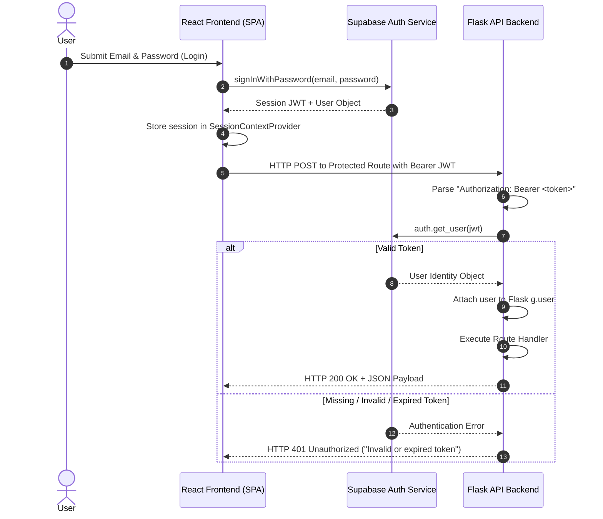
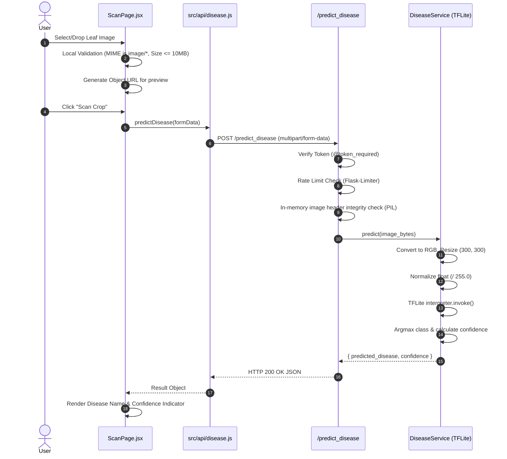
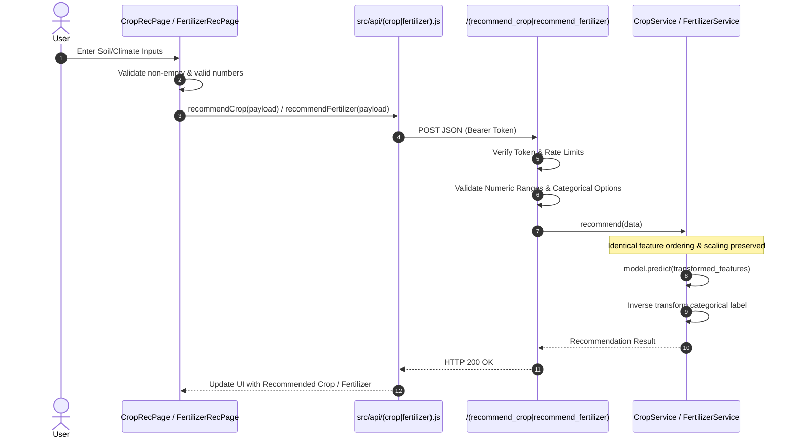
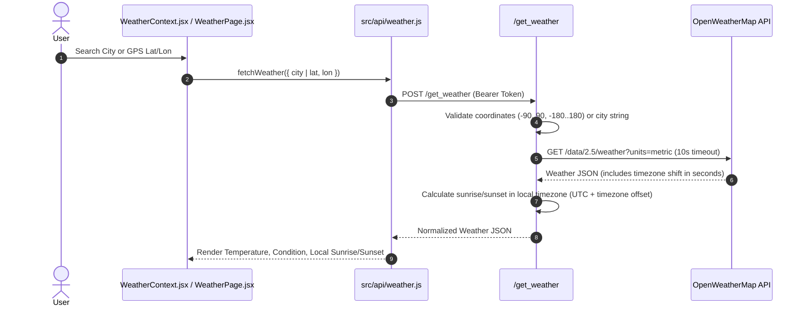
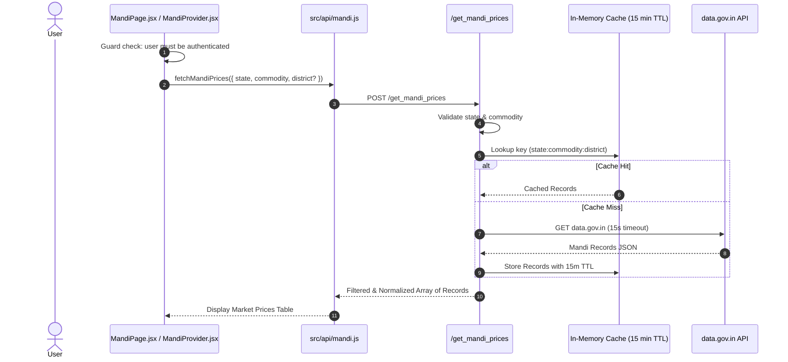

# Request & Data Flow Specifications

## 1. Authentication & Session Flow

## 2. Disease Detection Scan Flow

## 3. Crop & Fertilizer Recommendation Flow

## 4. Real-time Weather Flow with Timezone Correction

## 5. Mandi Market Prices Flow

